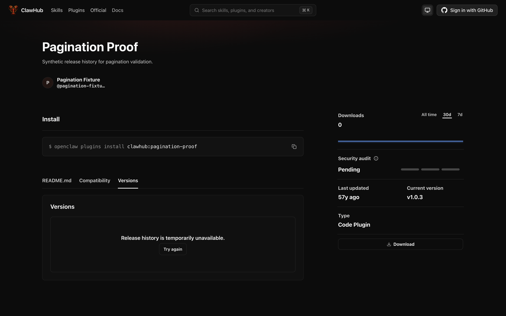
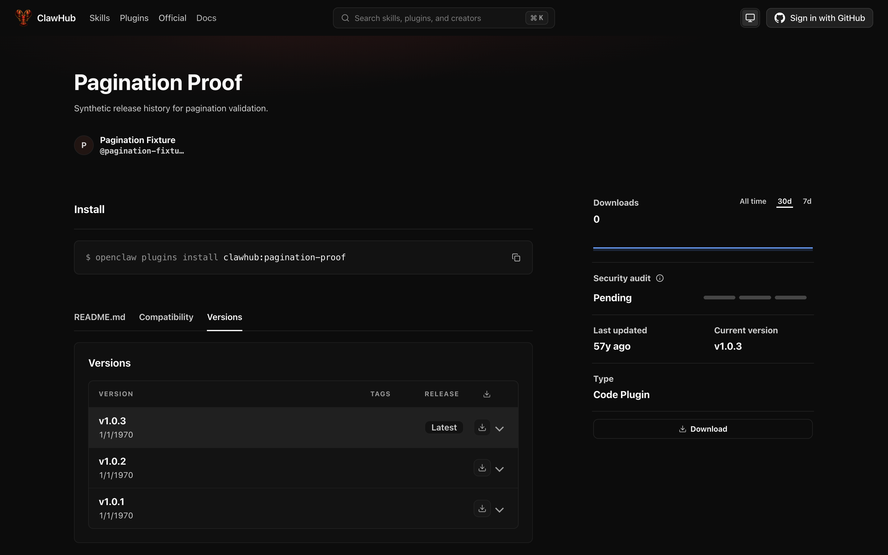

# Package version pagination: real local proof

- Baseline commit: `8298d86e4dac83dc377bf06f9a94de4a81644b22`.
- Candidate `convex/packages.ts` Git blob: `2d62cb5093066358775f1f33e6fa561cd47222a6`.
- Convex CLI: `1.44.0`; local backend artifact: `precompiled-2026-09-11-157eb19` (the binary reports `local_backend unknown` for `--version`).
- The real local Convex backend used isolated synthetic state, with scheduled tasks disabled and no production credentials.

## Reproduction

Fixture `pagination-proof` contains 60 newer pending or blocked releases before three older public releases: published `1.0.3`, legacy status-absent `1.0.2`, and published `1.0.1`. It also contains a newer deleted published release.

```sh
curl -i 'http://127.0.0.1:3271/api/v1/packages/pagination-proof/versions?limit=2'
```

The baseline returns HTTP 500:

```text
This query or mutation function ran multiple paginated queries.
Convex only supports a single paginated query in each function.
```

The candidate returns HTTP 200. Following each returned `nextCursor` produces five empty pages, then `[1.0.3, 1.0.2]`, then `[1.0.1]` with no next cursor. All seven requests succeed. No published release is lost or duplicated, and pending, blocked, and deleted releases remain hidden.

## Bounds and continuation

- With 510 newer pending or blocked rows and `limit=100`, the first HTTP page is empty with a usable cursor. The second page contains all three public releases.
- With 202 public releases, the public `packages:listVersions` query with `numItems: 250` returns 200 rows, then two rows. All 202 versions are unique.
- A caller-supplied `maximumRowsRead: 1` returns one row, preserving the lower scan limit.

## Browser proof

The screenshots show the real ClawHub application at `http://127.0.0.1:3272/pagination-fixture/plugins/pagination-proof`, on its Versions tab, using the same fixture and local backend.

Before the change, release history is unavailable. After deploying the candidate and clicking **Try again**, all three public versions appear. Both screenshots were visually inspected.





## Cleanup

The local backend, app server, and proof browser tab were stopped. Temporary fixture code, configuration, and backend state were removed. The proof checkout is clean.
